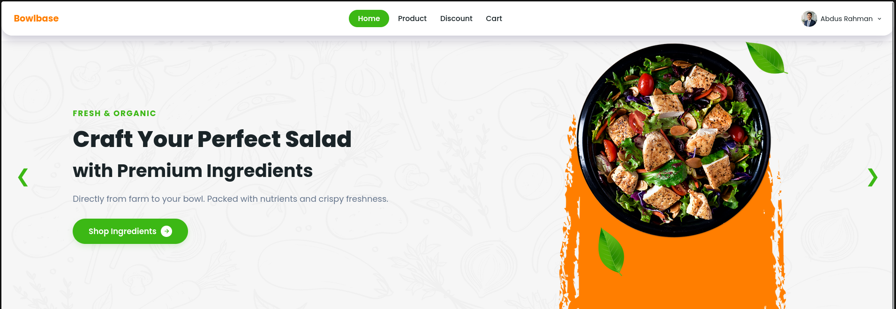

# 🥗 Bowlbase - Premium Salad & Healthy Meal Kits

Bowlbase adalah platform e-commerce modern yang menyediakan bahan-bahan salad premium dan paket makanan sehat siap masak (*meal kits*). Proyek ini dibangun dengan pendekatan arsitektur terpisah (*separated repositories*) untuk memisahkan logika UI (Front-end) dan sistem server (Back-end) demi performa dan kemudahan skalabilitas.

---



## 🔗 Tautan Repositori (Multi-Repo Architecture)
Untuk menjaga kebersihan kode dan kemudahan *deployment*, proyek ini dibagi menjadi dua bagian:
*   **Repository Front-end (Repository Ini):** [https://github.com/Fairuz-bit/Bowlbase](https://github.com/Fairuz-bit/Bowlbase)
*   **Repository Back-end:** *(Coming Soon )*

---

## 🛠️ Tech Stack

### Front-end (Repository Ini)
*   **HTML5** – Struktur semantik halaman web.
*   **CSS3** – Desain tata letak kustom, responsif, dan modern.
*   **Boxicons** – Pustaka ikon premium untuk navigasi dan detail produk.

---

## 🚀 Fitur Utama (Front-end)
*   **Responsive Landing Page:** Desain intuitif yang menyesuaikan tampilan layar *desktop* maupun *mobile*.
*   **Modern Navigation Bar:** Akses cepat ke halaman Beranda, Produk, Diskon, dan Keranjang Belanja.
*   **Premium Visual Showcase:** Presentasi produk salad segar dengan tata letak grid yang bersih untuk memanjakan mata calon pelanggan.

---

## 📦 Cara Menjalankan Proyek Secara Lokal

1. **Clone repository ini:**
   ```bash
   git clone [https://github.com/Fairuz-bit/Bowlbase.git](https://github.com/Fairuz-bit/Bowlbase.git)
